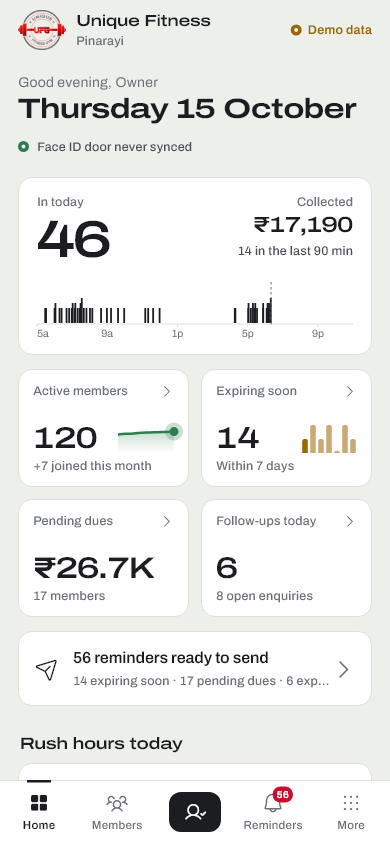
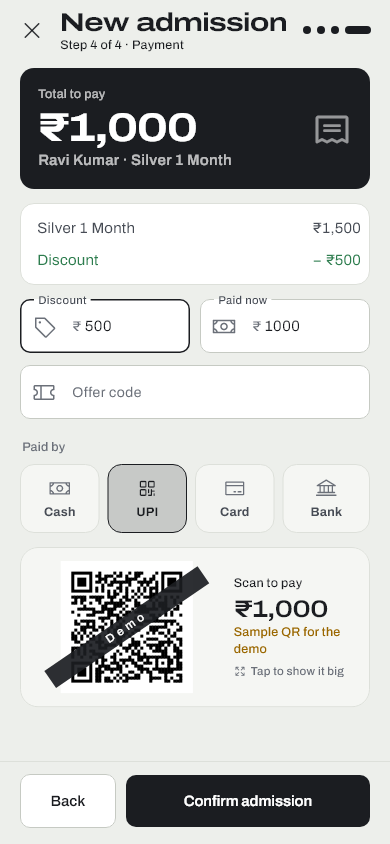
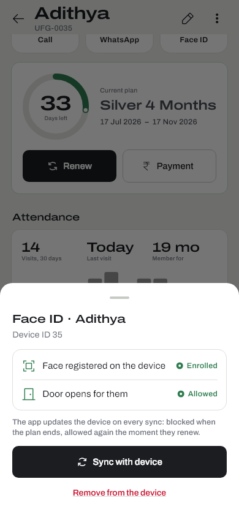
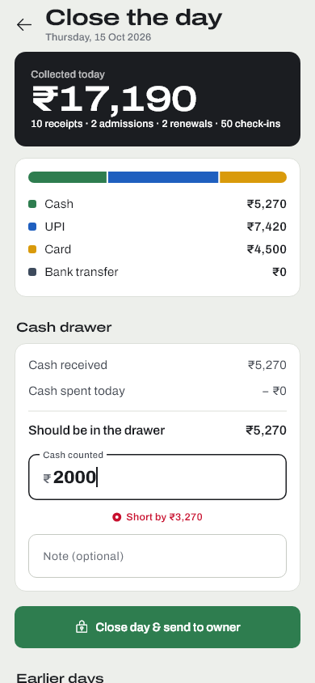
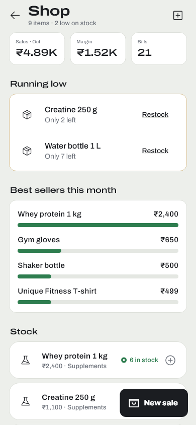
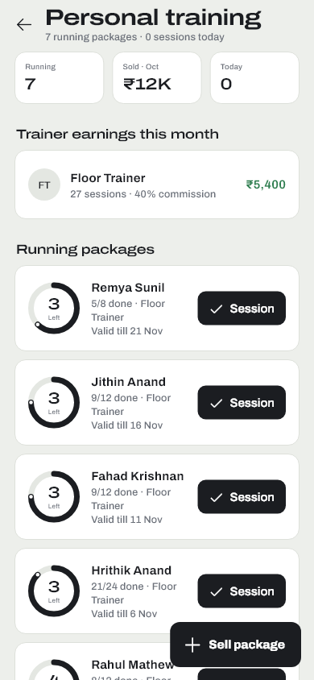
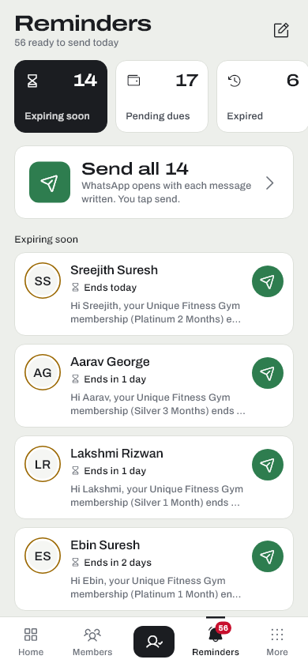
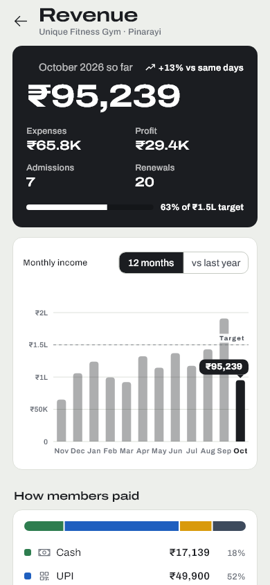
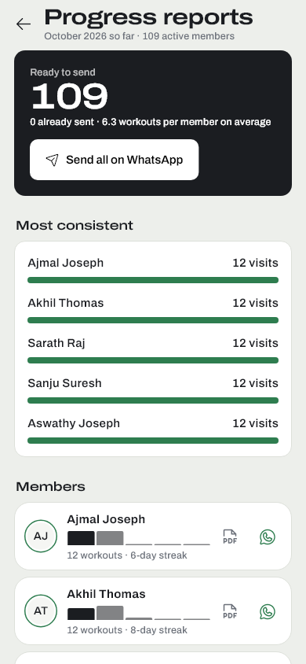
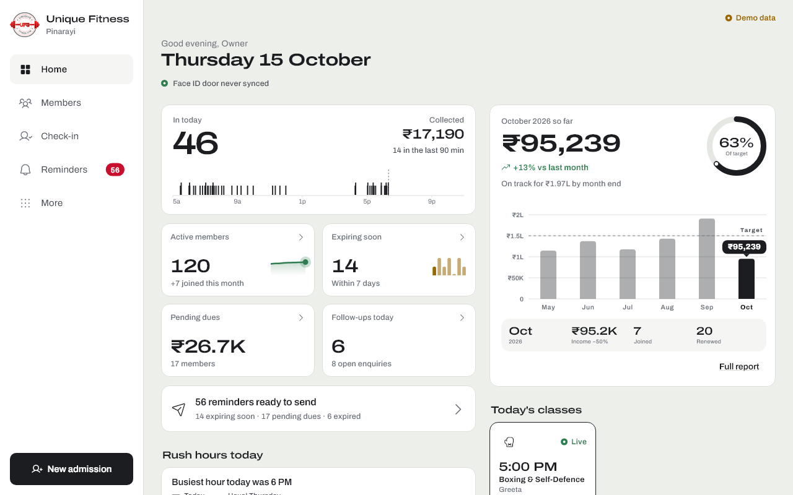

<p align="center"></p>

# Unique Fitness Gym: Front Desk

A Flutter app that runs the front desk of **Unique Fitness Gym, Pinarayi**: admissions with the
**eSSL Face ID door** registered from the app, renewals, one-tap WhatsApp reminders, a counter shop,
personal training, class batches, day close and the owner's revenue report. It is built for a real
gym, with its own logo, plans and timetable, and runs on **Android phones, Android tablets and
iPhone/iPad**.

**[▶ Try the live demo](https://pranavkk7.github.io/unique-fitness-gym/)** in your browser. It opens on two
years of fictional members, so every screen has data. The Face ID door is simulated in the browser.

Designed and developed by **Pranav KK**.

| Dashboard | New admission | Face ID registration |
|---|---|---|
|  |  |  |

| Close the day | Shop | Personal training |
|---|---|---|
|  |  |  |

| Reminders | Revenue | Progress reports |
|---|---|---|
|  |  |  |



## What the desk can do

**Admissions in four steps:**
1. Personal details with a photo.
2. Health, goals and a live BMI.
3. Plan, start date and trainer. Silver and Platinum come as metallic cards; each duration shows
   its monthly price and saving. The desk also notes how the member heard about the gym, and who
   **referred** them.
4. Payment. The bill updates as you type. The plan price is the whole fee, since the gym charges
   no joining fee. A discount or an **offer code** can be applied, and a part payment becomes a
   balance due.

The admission ends with confetti and next actions: register the face on the door, send a WhatsApp
welcome, or share a PDF receipt.

**Face ID door (eSSL / ZKTeco).** Members get in by face; there is no card.
- From a member's profile, **Register face** adds them to the terminal, then waits while they look
  at the camera.
- **Sync** pulls the door's entries into attendance.
- Expired or frozen members are blocked at the door, and optionally members with dues too.
- Syncing runs on its own every five minutes.

The protocol (TCP 4370) is implemented in Dart from the public ZK protocol and checked against
known packets in tests.

**One-button WhatsApp reminders.** Every day the app builds these lists:
- expiring soon
- pending dues
- recently expired
- members who stopped coming
- birthdays
- enquiry follow-ups
- monthly progress reports

**Send all** goes through a list one person at a time. WhatsApp opens with the message ready, the
send is logged, and the next person comes up. A cooldown stops repeats, and the wording is editable.

**Morning summary.** A notification at opening time lists plans ending soon, dues, birthdays and
follow-ups. It is rescheduled whenever the data changes.

**Front desk**
- **Day passes and free trials** for walk-ins. They are saved as enquiries, with a follow-up when
  the trial ends.
- **Class batches** have a capacity. Members are enrolled up to the limit, the roster shows who is
  in today, and one message can be shared to the batch's WhatsApp group.
- **Close the day.** Collections are shown by method: cash, UPI, card and bank. The cash drawer is
  counted against what it should hold, and the day's report goes to the owner on WhatsApp. Earlier
  days show whether the drawer matched.

**More revenue**
- **Shop.** Supplements, drinks and merchandise, with stock, low-stock alerts and margin. Restocking
  with a cost also books the expense. Selling an item is a tap-to-add cart, and stock can never go
  below zero.
- **Personal training packages.** A ring shows the sessions left, and one tap marks a session. Each
  trainer's commission for the month is worked out from the sessions taken.
- **Offer codes** (percent or rupees off, end date, use limit) and **referral rewards**: the member
  who brings a friend gets free days added automatically.

**Member engagement**
- **Workout and diet plans.** The templates use everyday Kerala food and are editable. Plans are
  assigned from the profile and shared as a branded PDF.
- **Monthly progress reports** cover workouts, best streak, weekly visits and weight change. They
  go out on WhatsApp or as a PDF.
- **Feedback log.** Each entry has stars, a topic and a comment. Low ratings stay on *Needs action*
  until resolved.

**Money**
- **Cash or UPI.** For cash, the app suggests the note the member will hand over and shows the
  change. For UPI, the gym's own UPI QR appears with the amount filled in. The last method used is
  pre-selected next time.
- **Receipts** go out on WhatsApp or as a PDF. They cover members and walk-ins (day passes, shop
  sales).
- **Expenses** include one-tap trainer salaries.

**Owner's revenue report** (behind a PIN)
- Monthly income bars that can be scrubbed by touch.
- A comparison with the same month last year, and a target line.
- Profit, the payment-method split, the renewal rate, a busy-hours heatmap and lead sources.

## Design and motion
The look is called **Plate & Chalk**: a gym floor, not a tech dashboard.
- **Colour.** White sheets on a chalk-grey background, with iron-black text and buttons. Colour
  means state, taken from weight-plate colours: green is active, yellow is expiring, blue is
  frozen, and the logo's red is only used for dues and problems.
- **Type.** Archivo for reading and Archivo Expanded for headings and figures, in sentence case.
  Figures use tabular digits so amounts line up.
- **Icons.** Phosphor's thin regular set, drawn in ink rather than in coloured badges.
- **Signature.** The dashboard's door log draws one tick per check-in across the day, and
  status is shown as a small plate ring next to the words.
- **Motion.** Kept for moments that answer an action:
  - The door log draws in once when the dashboard opens, and today's count rises with it.
  - Avatars move from the list into the profile.
  - The admission steps slide in the direction of travel.
  - A drawn tick marks a check-in.
  - Shared curves and durations live in `core/theme/motion.dart`.
- **Platform transitions.** Android uses its predictive-back fade; iPhone uses the native swipe-back.
- **Reduced motion respected.** With the system setting on, everything appears in its final state.
- **Adaptive layout:**
  - Phones get a flat bottom bar with a check-in key in the middle.
  - Tablets get a side rail in landscape, and nine quick actions in a row in portrait.
  - Pages are capped in width, so they read well on a front-desk tablet.

## Architecture
```
lib/
  models/      members, plans, payments, PT packages, products, offers, plans, feedback, settings
  data/        GymStore interface, HiveGymStore (device), MemoryGymStore (tests), seed and demo data
  providers/   GymProvider (state + rules), split by area: memberships, sales, desk, records,
               setup; plus GymAnalytics, GymMessages, GymReports
  device/      eSSL/ZK protocol, TCP client, demo terminal, DeviceService (sync, enrol, door rules)
  core/        theme, widgets (cards, charts, PIN pad, motion), PDF kit, notifications
  features/    dashboard, members, admission, checkin, device, reminders, reports, money, shop,
               training, desk (day pass, close the day), engagement (plans, progress, feedback), more
```
- **One place for the rules.** `GymProvider` owns every rule: billing, renewals, freezes, stock,
  PT sessions, offers, referrals and the day close. Screens only read state and call methods.
- **Testable dates.** The clock is injectable, so date rules are tested exactly.
- **Storage that scales.** Each record is saved on its own in Hive, so a check-in writes one small
  record.
- **Swappable backend.** `GymStore` is an interface; moving to a cloud backend means writing one
  class.

## Run it
```bash
flutter pub get
flutter run                 # Android phone/tablet, iPhone/iPad, or emulator
flutter run -d chrome       # or try it in the browser
```
- On first launch the app has the gym's real plans, coaches, timetable and workout/diet templates.
- Tap **Load demo** to explore two years of fictional members (the
  [live demo](https://pranavkk7.github.io/unique-fitness-gym/) does this for you). While demo data is loaded, WhatsApp
  and calls show a preview instead of contacting anyone, and the UPI QR is a sample.
- The gym's UPI ID is not in this repository. The gym's own build passes it with
  `--dart-define-from-file=private/gym.json` (a git-ignored file); otherwise it is entered once in
  **Settings**.

## Test
```bash
flutter analyze
flutter test        # 96 tests: business rules, Face ID protocol, storage, demo data, screens
```
- **CI** analyzes, tests and builds the web app on every push.
- **On `main`** it also builds an Android APK (downloadable from the run's artifacts) and an
  unsigned iOS build.

Regenerate the screenshots (real fonts, fixed demo date, phone and tablet sizes):
```bash
flutter test tool/screenshots_test.dart --update-goldens
```

## Privacy
- Member data stays on the gym's device.
- The app talks only to the Face ID terminal on the gym's own network. WhatsApp, calls and sharing
  open the phone's own apps, and nothing leaves until a person presses send.
- All demo members are fictional.

## Roadmap
- Cloud sync and staff logins with roles, then the other branches.
- Automatic reminders through the WhatsApp Business API.
- A member app with class booking and their own progress.
- GST invoices and biometric unlock.

## Credits
- **Design and development:** Pranav KK.
- Logo, name, plans and timetable belong to Unique Fitness Gym and are used with the owner's
  permission.
- **Fonts and icons:** Archivo (SIL Open Font License), Phosphor icons (MIT) and a rupee-sign
  subset of Roboto (Apache 2.0). Licences are in `assets/fonts`.
- The previous dark design is kept on the `classic-design` branch.
